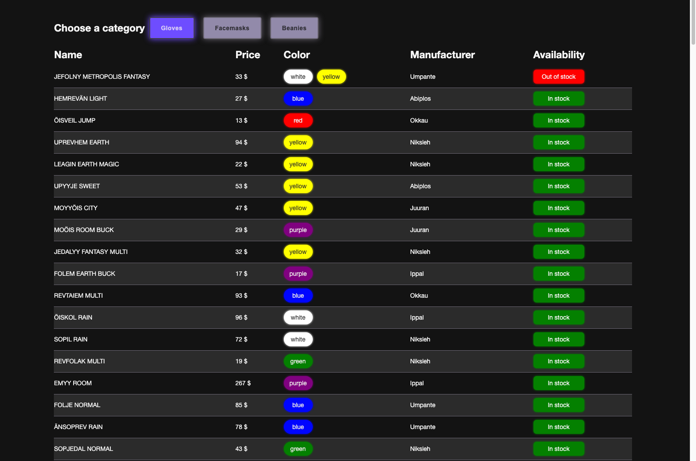

# Reaktor junior dev assignment

This repo contains code written to solve the pre-assigment to apply for the position "2021 Summer junior developer intern" at [Reaktor](https://www.reaktor.com/)

## Brief

> Your client is a clothing brand that is looking for a simple web app to use in their warehouses. You need to provide a fast and simple listing page per product category, where is possible to check simple product and availability information from a single UI. There are three product categories for now: gloves, facemasks, and beanies. One requirement is to be easily able to switch between product categories quickly. You are provided with two different legacy APIs that combined can provide the needed information. The legacy APIs are on critical-maintenance-only mode, they have a built-in intentional failure case 

## Architectural design

My solution consists in a React web application which is responsible of calling the two API and display the reqested info.

## Production website

Live version is available at [https://reaktorapp.tiberiogalbiati.com/](https://reaktorapp.tiberiogalbiati.com/)

## Screenshot

## Implementation details

- [x] Redux state management 
- [x] Redux-saga middleware to fetch data and create a local cache
- [x] Automatic retry of fetching data if a error happens 
- [x] Products categories can be easily added if needed 
- [x] Custom styled HTML table based on a headless library to access data more easily
- [x] Infinite scroll, with automatic load on bottom reached
- [x] Fast switch of categories  
- [x] Skeleton loaders for slow API response
- [x] Dynamic display of item colors
- [x] Configured a server-side proxy to handle CORS errors
- [ ] Sticky header
- [ ] Searching and filtering
- [ ] Improved responsiveness
- [ ] Test automation

## Libraries used
* [React](https://reactjs.org/)
* [Redux](https://redux.js.org/)
* [Redux Saga](https://redux-saga.js.org/)
* [Styled Components](https://styled-components.com/)
* [React Table](https://github.com/tannerlinsley/react-table)
* [react-infinite-scroll-component](https://github.com/ankeetmaini/react-infinite-scroll-component)
* [react-loader-spinner](https://www.npmjs.com/package/react-loader-spinner)

## Author
* [Tiberio Galbiati](https://github.com/TiberioG)
